Miquel Marquès Bravo

AA1 Windows Server amb Zorin

1. # **Mostra la informació de DC: domini i adreça.**
   Un cop tenim desplegat l'Active Directory podem veure que el nostre servidor estar com a controlador de domini del nostre domini. També per poder connectar el Zorin el que fem és veure quina IP té per poder-li aplicar com a DNS.
   

   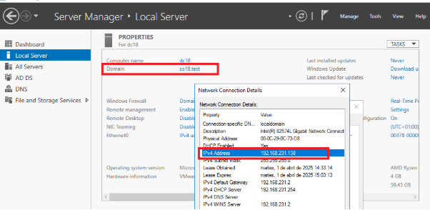
   

   Una altra cosa que podem fer és afegir un reenviador condicional a la màquina perquè vagi molt més fluida.
   

   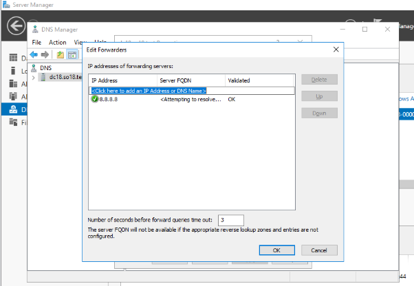
   

1. # **Configuració de xarxa de l'Ubuntu Desktop i comprovació que resol el domini del directori actiu**
   Gràcies que en l'anterior punt hem mirat quina IP té el servidor si ara volem aplicar-li al Zorin solament caldra modificar la configuració de la xarxa i desactivar el DNS automàtic i aplicar la IP 192.168.231.138 que és la del Windows Server.
   

   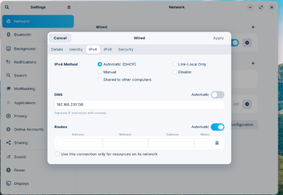
   

   I ara comprovem que vegi al Windows server i que també pugui sortir a l’exterior.

**Comprovació domini SO18.test**
   

   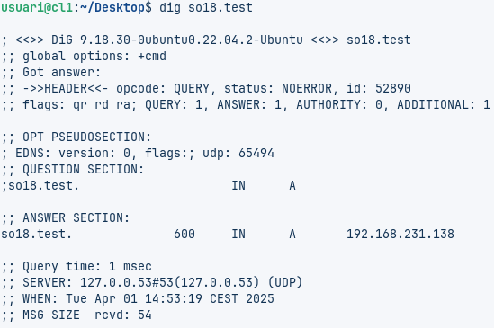

**Comprovació exterior**
   

   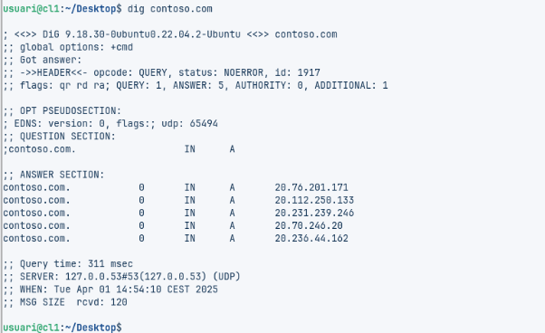

1. # **Procés instal·lació ssd i configuració**
   El primer que farem és modificar el nom complet de la màquina (FQDN). Pel nom que volem i després posem el nom del domini.
    

   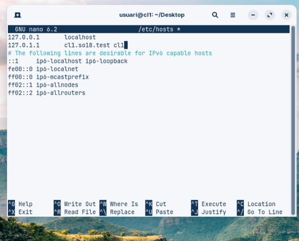
   

   Un cop realitzat comencem a realitzar la instal·lació de ssd i totes les seves eines.
   

   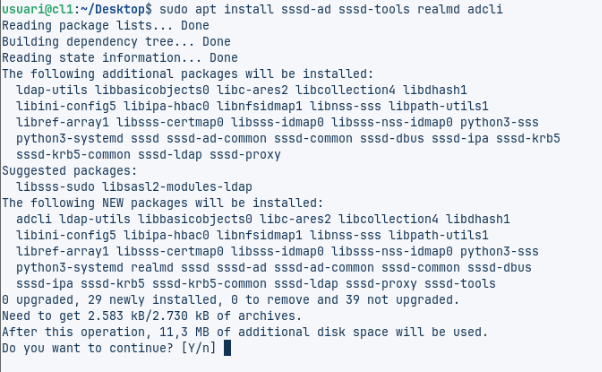
   

   Un cop instal·lat comprovem que el nostre Zorin té la mateixa hora que el nostre Servidor, ja que si no la tinguessin El sistema Kerberos no funcionaria. *(en les captures hi ha 2 minuts de diferència perquè ha estat el temps entre captura i captura)*
   

   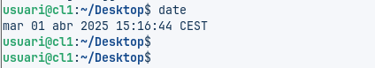
   

   

   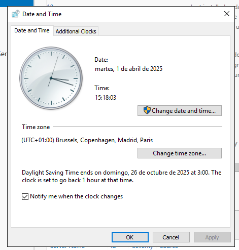
   

   I ara comprovem que podem veure el servidor Windows Server amb SSD i que podem obtenir la informació del servidor per poder seguir.
   

   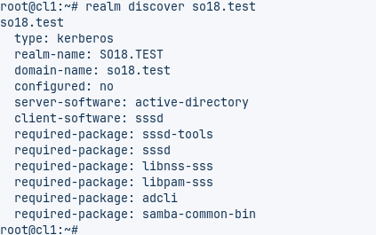
   

   Un cop realitzada la comanda ens unim al servidor so18.test per realitzar-ho executarem la comanda realm join [servidor] i ens demanara la contrassenya, realment està realitzant la mateixa acció que en el Windows 10 /11.
   

   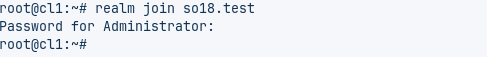
   

   I ara si realitzem una altra vegada la comanda discover veiem que mostra que ja som membres
   

   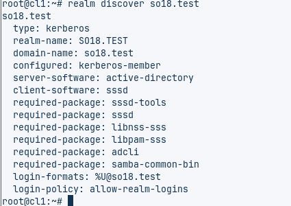
   

   El mateix passa si anem al Windows Server i al Active Directory User and Computers en l'apartat d'ordinadors.
   

   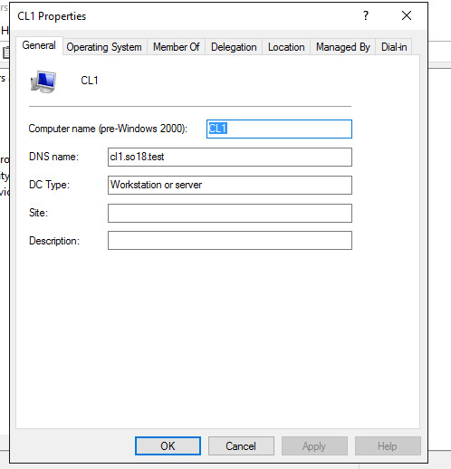
   

1. # **Configuració per tal que en connectar-se els usuaris del domini tinguin carpeta local**
   En aquest punt la configuració que hem de realitzar és de ben senzilla solament en el terminal realitzem un **sudo pam-auth-update  - -enable mkhomedir.**
   

   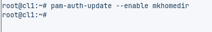
   

   I podem comprovar accedint des d'una sessió.
   

   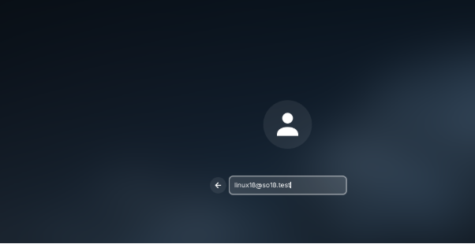
   

   I si executem la comanda pwd podem veure com s’ha creat la carpeta personal.
   

   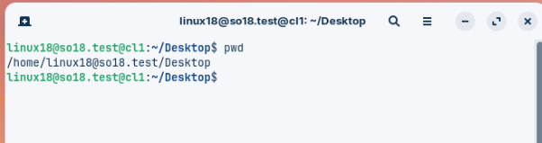
   

1. # **Crear grup linux admin al AD i agregar un usuari aquest grup**
   En aquest punt vaig en l'Active Directory i creo un grup anomenat Linux Administrators.
   

   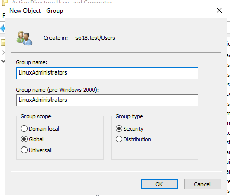
   

   I un cop en un usuari li donem clic dret i anem a propietats i anem a la pestanya de members of i afegim el nou grup
   

   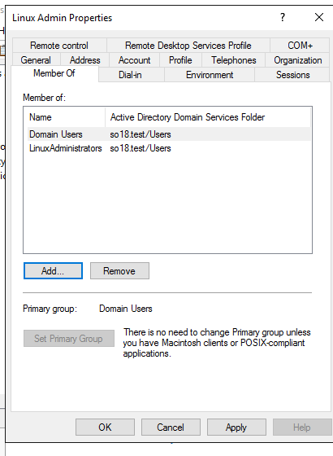
   

1. # **Configurar Ubuntu perquè els usuaris del grup linuxadmin siguin sudoers i siguin els únics usuaris que puguin iniciar sessió a l'equip Ubuntu**
   Per realitzar aquesta acció necessites estar amb un compte del Windows Server i des d'allà fer un su a l'usuari local i allà modificar l'arxiu. La raó per fer-ho perquè necessitem tenir activat el sssd. 
   

   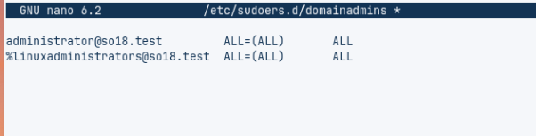
   

1. # **Inici de sessió amb l'usuari del grup linuxadmin i mostrar que és sudoer**
   Ara accedim de forma gràfica a l'usuari que està en el grup de sudoers, i per això pitgem el botó d'aquest usuari no està a la llista i allà poses el nom complet de l'usuari que és **linuxadmin@so18.test**
   

   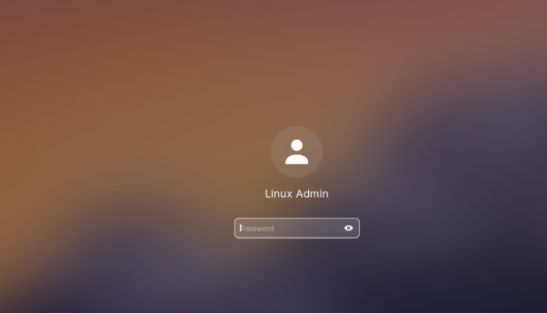
   

   I un cop accedit comprovem que podem fer sudo fent un sudo su.
   

   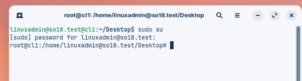
   

1. # **Part Extra: Permetre un grup seleccionat accedir a l’ordinador**
   El primer que fem és afegir en un dels usuaris un grup que hem creat que en aquest cas es diu finances.
   

   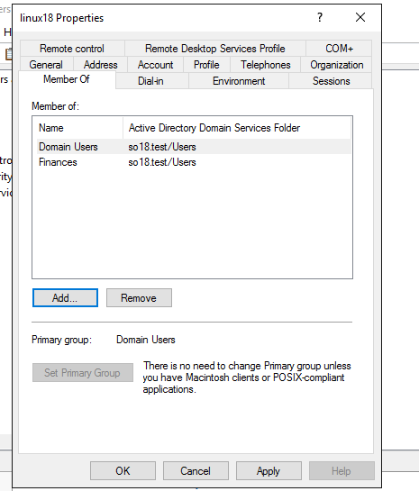
   

   I un cop fet anem al client i executem la comanda realm deny –all i després la comanda realm permit -g finances.
   

   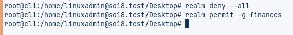
   

   I ara si provem d'entrar amb un usuari que no és de finances no hi podrà accedir.

   **Usuari de grup finances**
   

   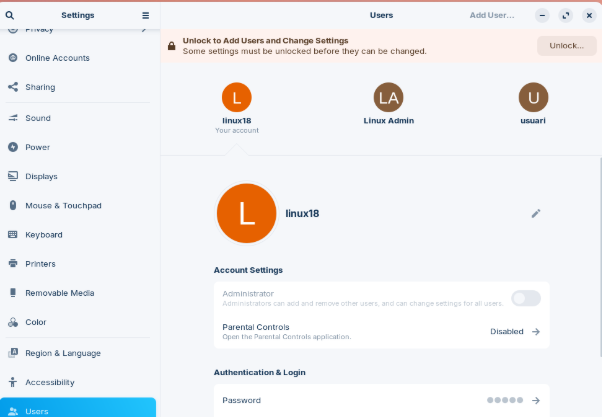
   

   **Usuari normal**
   

   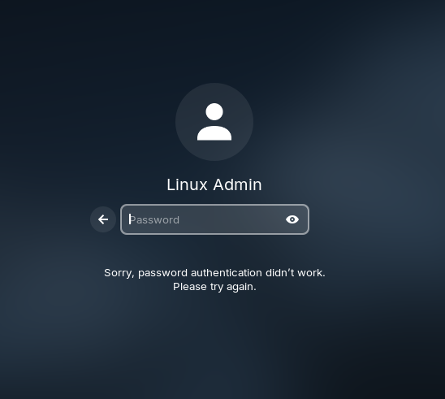
   

