[Miquel Marques Bravo](mailto:miquel.marques@mataro.epiaedu.cat)

AA1 Instal·lar un Ubuntu al AD DS

1. **Mostra la informació de DC: domini i adreça**.

   Com per poder realitzar aquesta pràctica necessitem tenir un Windows Server Màxim del 2022 perquè la versió de Kerberos del Windows server 2025 per sistemes operatius Linux no està realitzada i, per tant, és impossible de realitzar-ho el dia d'avui.

   El priemr que hem de fer és tenir un Windows Server amb un AD DS instal·lat i desplegat amb el seu nom de domini el nom del servidor i amb un o uns quants usuaris fets.

   

   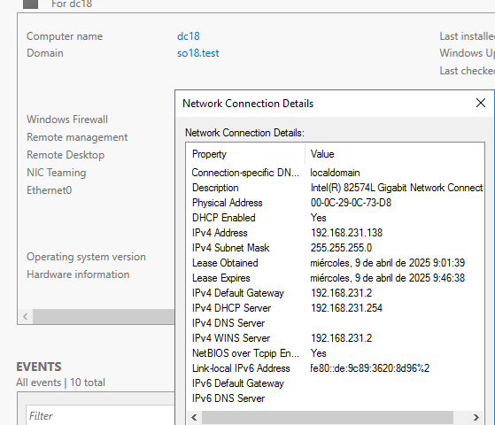
   

1. **Configuració de xarxa de l'equip Linux**

   Ara quan instal·larem el nou sistema operatiu al client abans de començar a fer la instal·lació tanquem l’apartat de la instal·lació o marquem que volem fer una prova.

   Per tal que se’ns obri el sistema operatiu que hi ha muntat en l'ISO.

   

   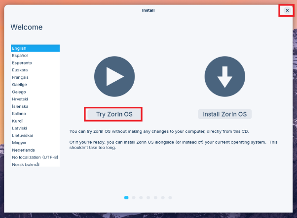
   

   Un cop hem dit que provem el sistema operatiu anem a l’apartat de xarxa del sistema i modifiquem el DNS per tal que pugui veure el domini correctament, ja que en un entorn real el servidor DHCP ja donaria l’adreça del DNS en aquell servidor.

   

   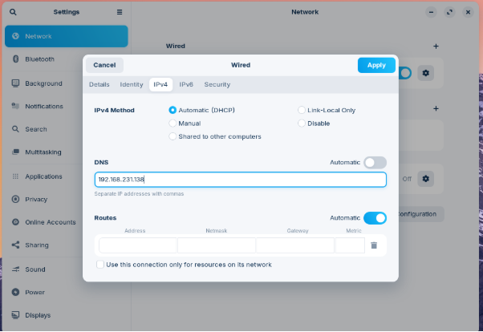
   

   Un cop fet reiniciem l’adaptador de xarxa i si volem podem fer una comprovació de què troba el domini i que té sortida a l’exterior.

   

   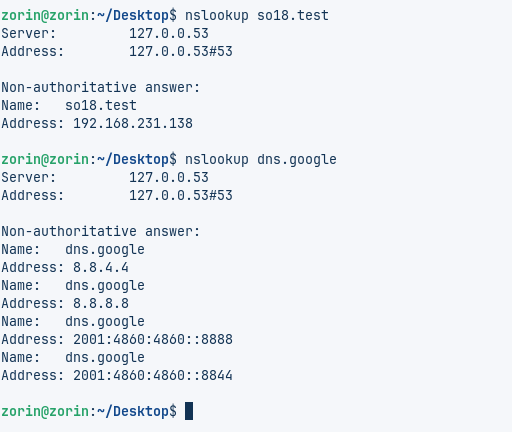
   

1. **Pas on es fa la connexió amb el domini: mostrar domini i comprovació.**

   Un cop feta aquesta configuració anem instal·lar el sistema operatiu a la màquina, per tant, comencem a fer el procés d’instal·lació normal fins a l'apartat de configuració de l'usuari.

   

   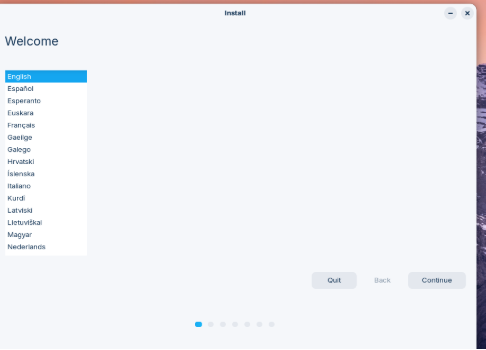
   

   Un cop estem a l’apartat de configuració de l'usuari posem un usuari local per si en un cas necessitéssim entrar com usuaris locals en la màquina. I selecciones l'opció de fer servir un directori actiu.

   

   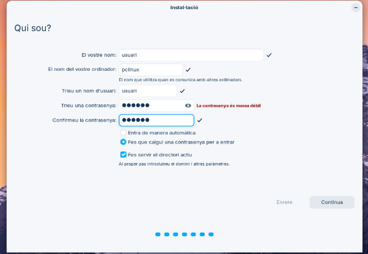
   

   Un cop fet en la següent pestanya ens preguntarà la configuració del AD DS. On hem de posar el Nom del domini i l'usuari administrador i la seva corresponent contrasenya.

   

   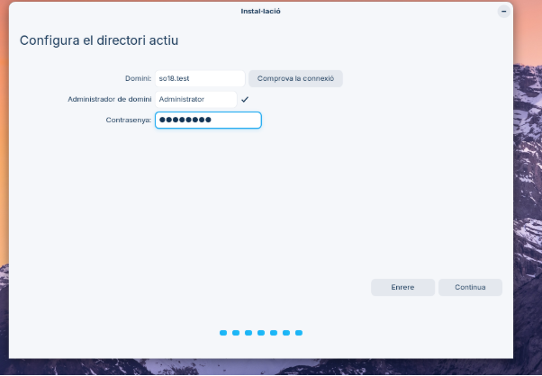
   

   Li donem a comprovar la connexió i en teoria ha de sortir correcte, ja que anteriorment ja ho havíem comprovat. I si és correcte es mostra amb un ✔️ i un cop fet li donem a continuar i ara ja es començarà a instal·lar el Zorin.

   

   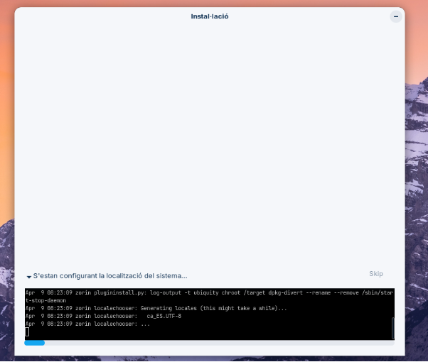
   

1. **Inici de sessió amb l'administrador del domini a l'equip Linux: mostrar login i sessió amb id.**

   Un cop instal·lat ara ja tenim tot realitzat i podem iniciar sessió en l’Active Directory. On provem d’accedir amb l’usuari administrador del domini.

   

   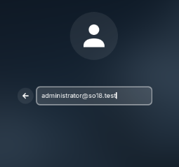
   

   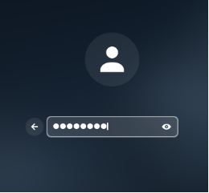
   

   Posem el nom i contrasenya de l'usuari administrador i automàticament crea la carpeta de l'usuari.

   

   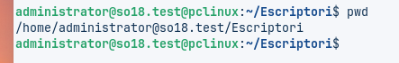
   

   I ara per veure el id podem fer la comanda id directament i veure els grups tot i que no es veuen del tot bé, però també fer la comanda id amb una sèrie de tuberies que ens permeten veure els id més correcte.

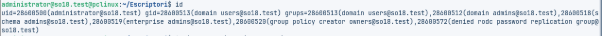

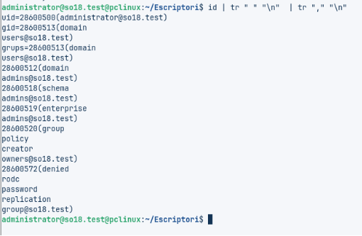

