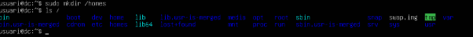
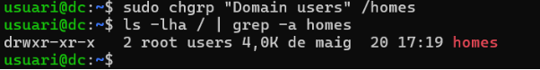
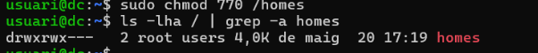
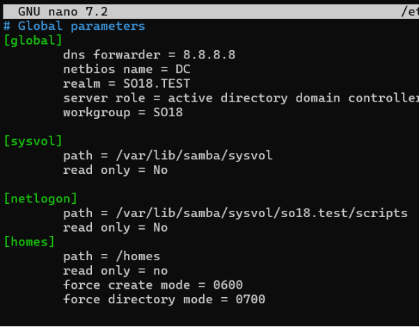
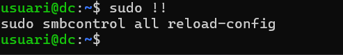
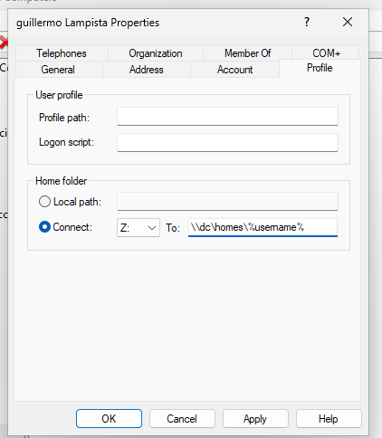
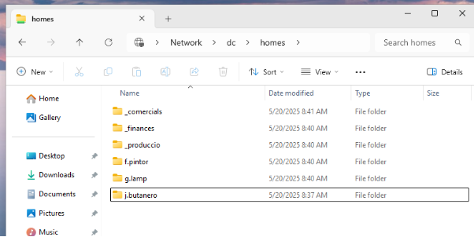
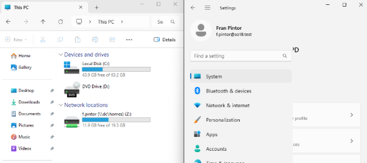

# 1. <a name="Creacio"></a>**Crear carpeta home amb els permisos adients.**

   En aquest punt, creem una carpeta que servirà per compartir-la amb samba.

   <p align="center">
   
   </p>

   I un cop creada posem que la propietat de grup es pels Domain users.

   <p align="center">
   
   </p>

   I seguidament posem que el grup també pot editar la carpeta

   <p align="center">
   
   </p>

# 2. <a name="Compartir"></a>**Compartim carpeta home a samba.**

   El que fem un cop creada compartim la carpeta com si fos una carpeta normal i afegim que forci el create mode en què solament l'usuari propietari té permisos.

   <p align="center">
   
   </p>

   I un cop fet recarregues tota la configuració de samba.

   <p align="center">
   
   </p>

# 3. <a name="ConfUsu"></a>**Configuració dels usuaris amb el RSAT.**

   En el Windows accedim com a administrador del domini i anem al Active Directory Users and Computers i allà anem a l'usuari que hem creat i posem en l’apartat de perfil la home folder amb la següent estructura:```\\dc\homes\%username%```

   <p align="center">
   
   </p>

   I un cop fet fem la comprovació i accedim a la carpeta i veiem les carpetes ja creades.

   <p align="center">
   
   </p>

# 4. <a name="Comprovacio"></a>**Comprovació amb un client**

   Un cop fet entrem amb un usuari del domini per poder comprovar-ho.

   <p align="center">
   
   </p>

