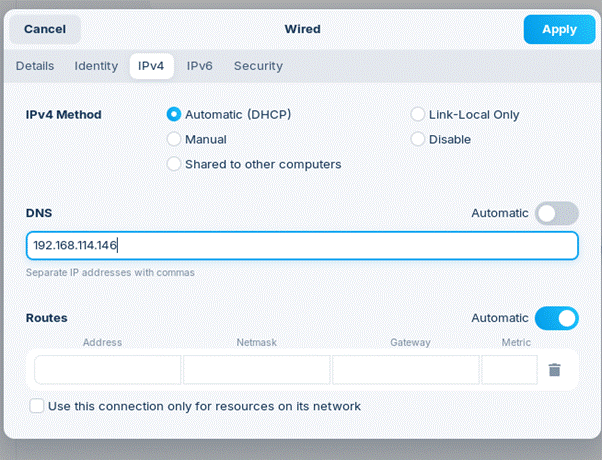
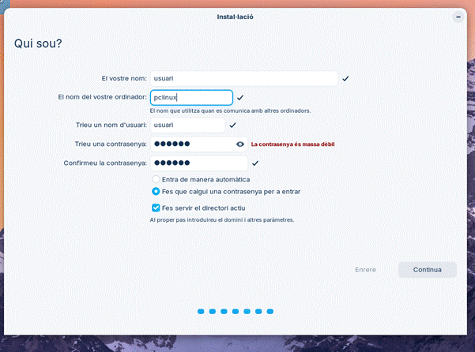
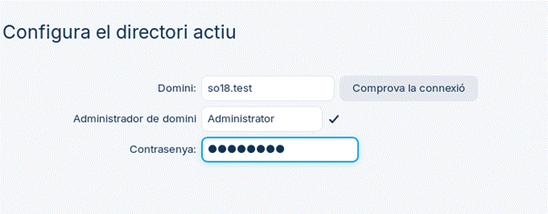
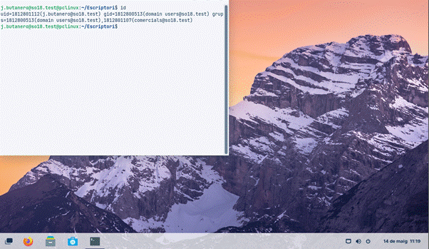

# 0. Introducció

Per configurar un equip Linux perquè accediexi al Domini de Samba 4 es pot realitzar de dues formes la configuració mentre s'instal·la o amb un client ja instal·lat, en aquest punt es mostra mentre ho instal·les. Et deixo dues guies per poder realitzar la configuració amb tots els pasos més detallats mentre s'instal·la i un cop tent el SO instal·lat.

**[Opció 1: Configurar des de un client ja instal·lat.](Altres/ConfiguracióLinux1.md)**

**[Opcio 2: Mentre s'instal·la](Altres/ConfiguracióLinux2.md)**

# 1.  Configuració de xarxa abans d’instal·lar

Abans d’instal·lar el Zorin hem de seleccionar que el volem provar per tal de poder modificar la xarxa perquè el DNS apunti al servidor SAMBA 4.

   

      
   

# 2. Creació usuari local

Com ja hem configurat el DNS ara ens posem a fer la instal·lació normal fins al punt que arribem a l'apartat d'usuari allà crearem un usuari local i marquem l'opció d'un directori actiu.

   

      
   

# 3.  Connectar el client al domini

Ara en la següent pantalla ens demanarà la configuració del domini, per tant, hem de posar el nom i l'usuari administrador amb la seva contrasenya.

   

      
   

# 4. Acces amb un usuari

En aquest punt anem a l’opció d'usuari no llistat i posem l'usuari com si fos un compte de correu ([usuari@so18.test](mailto:usuari@so18.test)) i un cop ho tenim posem la contrassenya.

   

      
   
