# Agregar Windows 11

## 1. <a name="ConfigXarxa"></a> **Conf. xarxa client preparada per ser agregat al domini**

En aquest fem que el nostre ordinador apunti com a DNS la màquina de Samba 4.

<p align="center">
      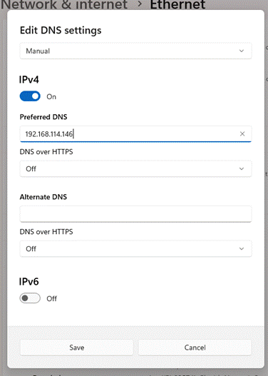
</p>

## 2. <a name="AgregarCl"></a> **Agregar client al domini**

Afegim l'ordinador com si l’afegíssim a Windows Server.SI vols saber com fer-ho et deixo un link a una altra guia on t'explica com fer-ho.

[Com fer-ho](https://github.com/miquelmarques/Guia-WinServer2025/blob/main/guia/WinServer25.md#141-configurar-la-m%C3%A1quina-windows-11)

<p align="center">
      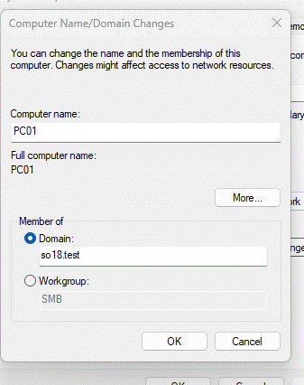</br>
      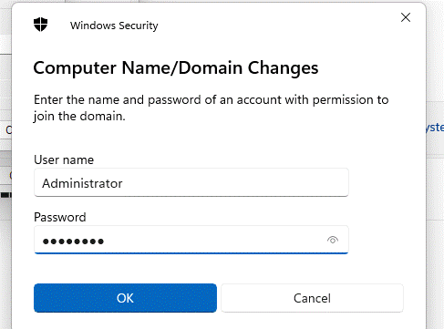 </br>
      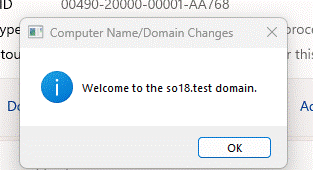
</p>

## 3.  <a name="LogInAdmin"></a>**Inici de sessió com usuari administrator**
    En aquest punt un cop es reinici la maquina podem accedir posant el nom del domini de forma NETBIOS o de forma de com si fos un correu electronic:
    ```
     NETBIOS: SO18\[usuari]

     Correu electronic: [usuari]@so18.test
    ```

     <p align="center">
      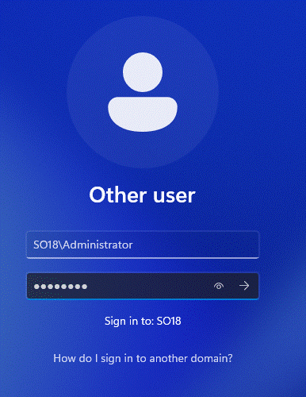 </br>       
      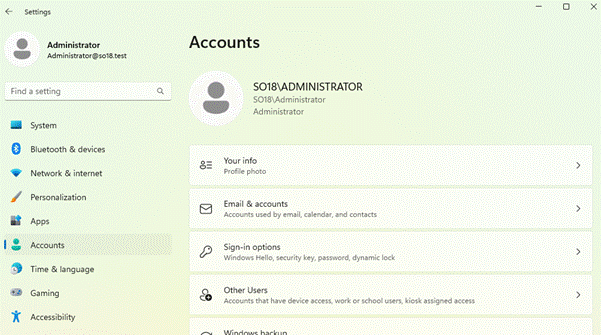
   </p>

# Instal·lació i configuració RSAT

## 1.  <a name="InsRSAT"></a>**Instal·lació característica RSAT**

En aquest punt anem a configuració >>> sistema >>> característiques opcionals >>> veure característiques i instal·lem la RSAT Active Directory Domain Services.

 <p align="center">
      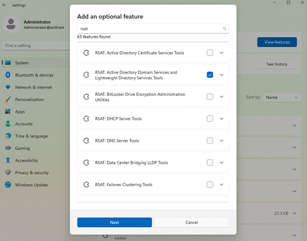 </br>
      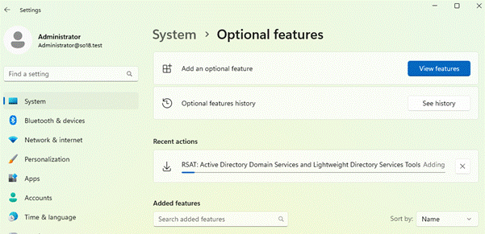
   </p>


## 2.  <a name="RSATADDS"></a>**Un cop tinguis l'eina instal·lada, cal desplegar una estructura de domini com la segúent:**

*   **Dues OUs: central i delegacio**
*   **Grups: finances, comercials, produccio**
*   **Crear un usuari plantilla per cada grup**
*   **Crea un usuari a partir d'una de les plantilles**

El primer que fem un cop hem accedit a Active Directory Users and Computers.

 <p align="center">
      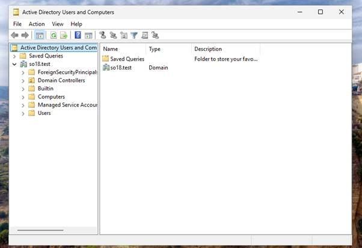
   </p>


En accedir creem els dues OUs en el nostre domini.

 <p align="center">
      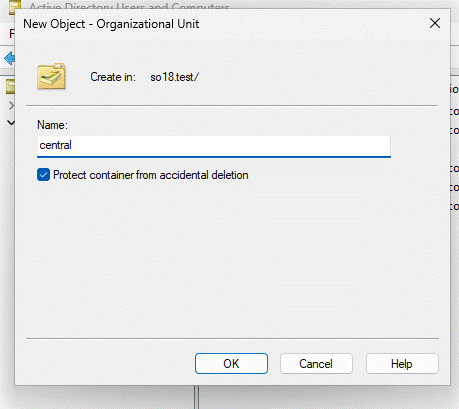 <br>
      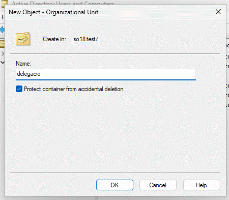
   </p>

I en el nostre cas crearem els grups i els usuaris en l'OU de central. Un cop allà comencem a crear els següents grups: finances, producció i comercials.

<p align="center">
      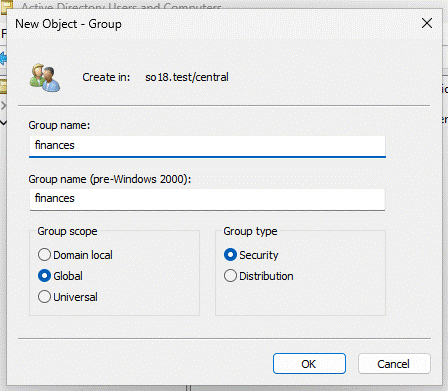 <br>
      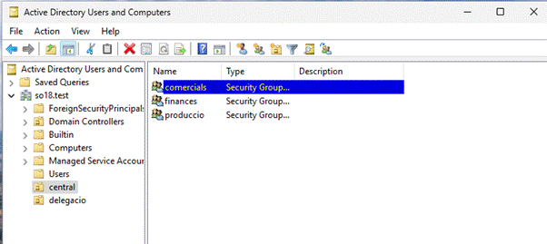 
   </p>

Ara amb l'usuari fet creem un usuari plantilla per cada grup

  <p align="center">
      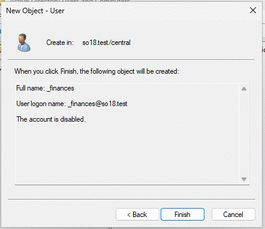 <br>
      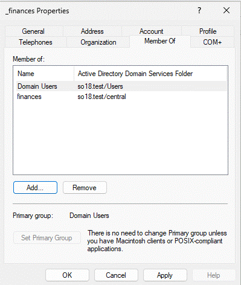 <br>
      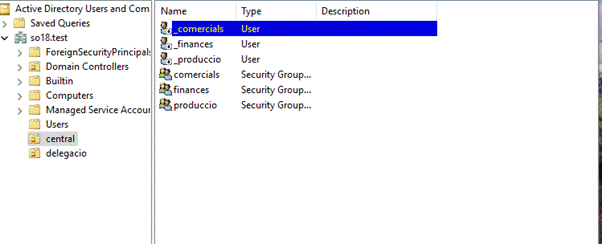
   </p>


I finalment copiem aquest usuari plantilla i accedim amb un d’ells

<p align="center">
      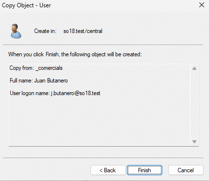 <br>
      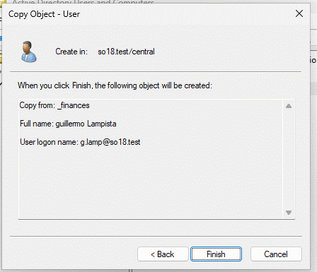 <br>
      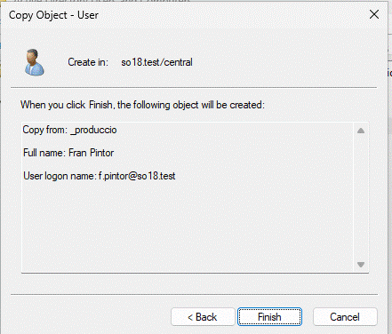
   </p>


I ara accedim a la màquina amb el compte de alguns dels exemples com ara Guillermo Lampista


<p align="center">
       <br>
       
   </p>